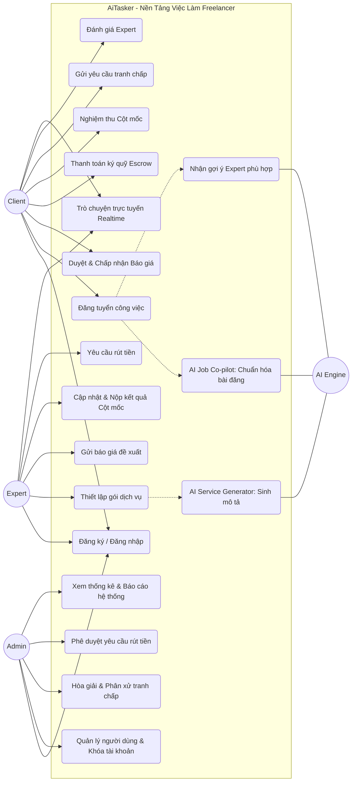
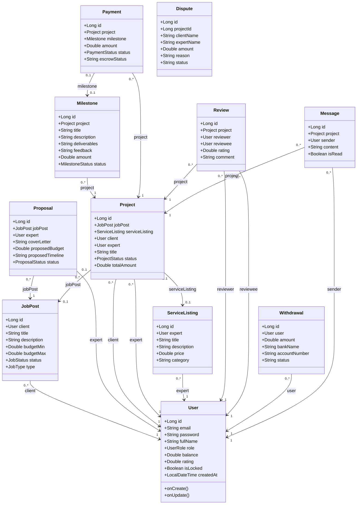
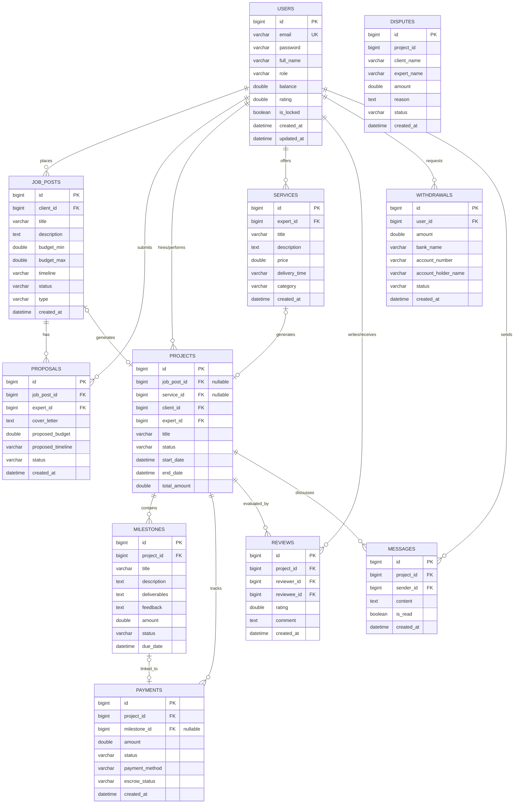
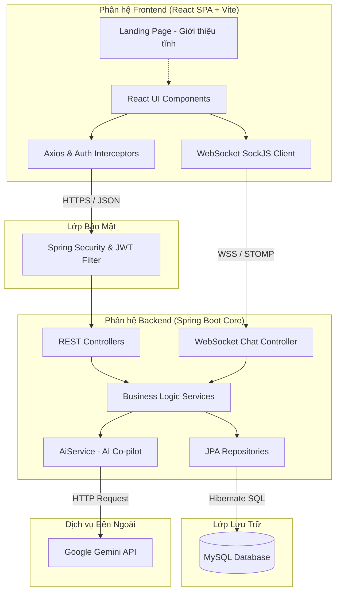
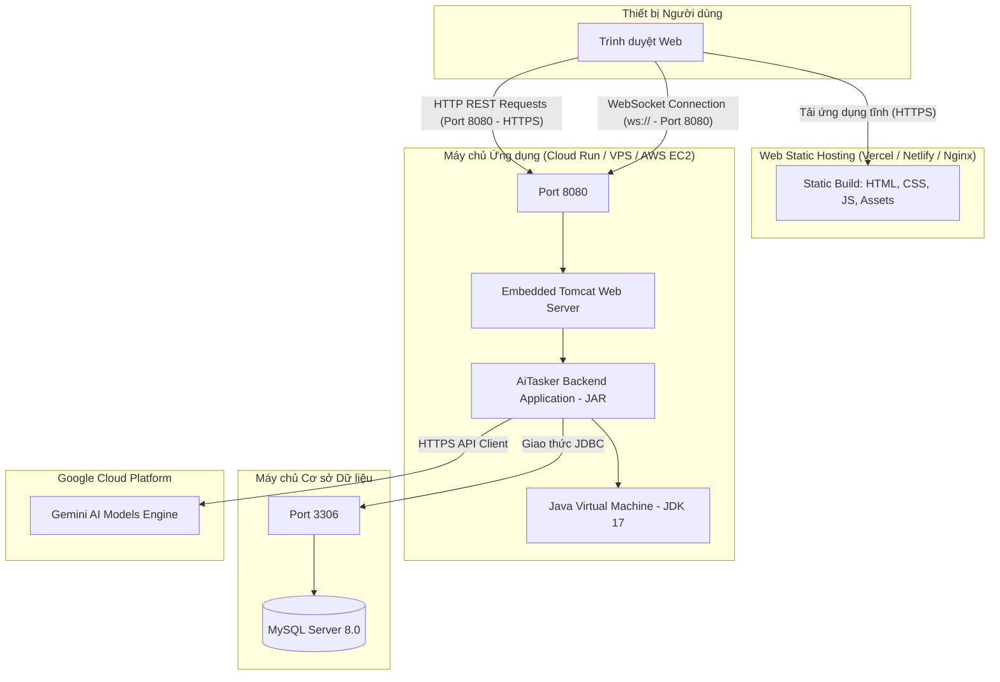

# Sơ đồ Kiến trúc & Thiết kế Hệ thống - AiTasker

Tài liệu này chứa toàn bộ các sơ đồ UML và ERD mô tả cấu trúc, luồng hoạt động và triển khai của dự án **AiTasker** (Nền Tảng Tìm Kiếm Việc Làm Tự Do Tích Hợp Trợ Lý AI).

---

## 1. Sơ đồ Ca sử dụng (Use Case Diagram)
Sơ đồ ca sử dụng mô tả các tác nhân (Actors) chính trong hệ thống gồm **Client (Nhà tuyển dụng)**, **Expert (Chuyên gia/Freelancer)**, **Admin (Quản trị viên)** và **AI Engine (Hệ thống AI trợ lý)**, cùng các chức năng họ có thể thực hiện.



---

## 2. Sơ đồ Hoạt động (Activity Diagram)
Sơ đồ hoạt động biểu diễn luồng quy trình nghiệp vụ cốt lõi: Đăng việc -> Đề xuất -> Ký quỹ -> Thực hiện theo Cột mốc -> Nghiệm thu / Tranh chấp -> Rút tiền.

```mermaid
flowchart TD
    Start([Bắt đầu]) --> PostJob["Client đăng bài tuyển dụng & tối ưu bằng AI"]
    PostJob --> AiSuggest["AI phân tích & gợi ý các Expert phù hợp"]
    AiSuggest --> SubmitProposal["Expert gửi báo giá & đề xuất"]
    SubmitProposal --> ReviewProposals["Client duyệt danh sách đề xuất"]
    
    ReviewProposals --> AcceptProposal{"Chấp nhận đề xuất?"}
    AcceptProposal -- "Không" --> ReviewProposals
    AcceptProposal -- "Có" --> CreateProject["Tự động khởi tạo Dự án"]
    
    CreateProject --> PayEscrow["Client thanh toán ký quỹ vào Escrow"]
    PayEscrow --> SetMilestones["Tạo các cột mốc dự án Milestones"]
    
    SetMilestones --> RunMilestone["Expert thực hiện công việc và nộp sản phẩm Cột mốc"]
    RunMilestone --> ClientReview{"Client nghiệm thu?"}
    
    ClientReview -- "Đạt" --> ReleasePayment["Giải ngân tiền ký quỹ của Cột mốc cho Expert"]
    ClientReview -- "Chưa đạt & Cần sửa" --> RunMilestone
    ClientReview -- "Chưa đạt & Tranh chấp" --> RaiseDispute["Gửi yêu cầu tranh chấp lên Admin"]
    
    RaiseDispute --> AdminResolve{"Admin phân xử"}
    AdminResolve -- "Release" --> ReleasePayment
    AdminResolve -- "Refund" --> RefundClient["Hoàn tiền ký quỹ lại cho Client"]
    
    ReleasePayment --> CheckMoreMilestones{"Còn Cột mốc tiếp theo?"}
    RefundClient --> CompleteProject["Hoàn thành / Kết thúc dự án"]
    
    CheckMoreMilestones -- "Còn" --> RunMilestone
    CheckMoreMilestones -- "Hết" --> CompleteProject
    
    CompleteProject --> ReviewEachOther["Hai bên gửi đánh giá Review lẫn nhau"]
    ReviewEachOther --> ExpertWithdraw["Expert gửi yêu cầu rút tiền về ngân hàng"]
    ExpertWithdraw --> AdminApprove{"Admin phê duyệt?"}
    AdminApprove -- "Từ chối" --> RejectWithdraw["Thông báo từ chối & hoàn số dư"]
    AdminApprove -- "Đồng ý" --> Transferred["Chuyển khoản thành công"]
    
    RejectWithdraw --> End([Kết thúc])
    Transferred --> End
```



---

## 3. Sơ đồ Tuần tự (Sequence Diagram)

Phần này mô tả chi tiết hai quy trình tuần tự quan trọng nhất của hệ thống thể hiện sự phối hợp giữa Frontend, Controllers, Services, Repositories và CSDL.

### Quy trình 3.1: Chấp nhận Báo giá & Thanh toán Ký quỹ (Escrow)
Mô tả cách thức Client chấp nhận một đề xuất báo giá (Proposal) để tạo Dự án ([ProjectService.java](file:///d:/study/do%20an/AlTasker/backend/src/main/java/com/aitasker/service/ProjectService.java)) và tiến hành nạp tiền ký quỹ ([PaymentService.java](file:///d:/study/do%20an/AlTasker/backend/src/main/java/com/aitasker/service/PaymentService.java)).

```mermaid
sequenceDiagram
    autonumber
    actor Client as Client (Trình duyệt)
    participant ProjCtrl as ProjectController
    participant ProjServ as ProjectService
    participant ProRepo as ProposalRepository
    participant JobRepo as JobPostRepository
    participant ProjRepo as ProjectRepository
    participant PayCtrl as PaymentController
    participant PayServ as PaymentService
    participant UserRepo as UserRepository
    participant PayRepo as PaymentRepository
    database DB as CSDL MySQL

    Note over Client, DB: Luồng A: Chấp nhận Báo giá & Tự động tạo Dự án
    Client->>ProjCtrl: POST /api/projects/proposal/{proposalId}
    activate ProjCtrl
    ProjCtrl->>ProjServ: createProjectFromProposal(proposalId, clientEmail)
    activate ProjServ
    
    ProjServ->>ProRepo: findById(proposalId)
    ProRepo-->>ProjServ: Trả về Proposal & JobPost tương ứng
    
    ProjServ->>ProRepo: setStatus(ProposalStatus.ACCEPTED)
    ProjServ->>ProRepo: Từ chối các Proposal khác cùng JobPost (REJECTED)
    ProjServ->>JobRepo: setStatus(JobStatus.IN_PROGRESS)
    
    ProjServ->>ProjRepo: save(New Project)
    ProjRepo->>DB: INSERT INTO projects (status=ACTIVE)
    DB-->>ProjRepo: Trả về Project Entity (id)
    
    ProjServ-->>ProjCtrl: Trả về ProjectResponse
    deactivate ProjServ
    ProjCtrl-->>Client: HTTP 201 Created (ProjectResponse)
    deactivate ProjCtrl

    Note over Client, DB: Luồng B: Tạo Thanh toán Ký quỹ (Escrow Payment)
    Client->>PayCtrl: POST /api/payments (projectId, milestoneId, amount, paymentMethod)
    activate PayCtrl
    PayCtrl->>PayServ: createEscrowPayment(clientEmail, PaymentRequest)
    activate PayServ
    
    PayServ->>ProjRepo: findById(projectId)
    ProjRepo-->>PayServ: Trả về Project
    
    PayServ->>PayRepo: save(New Payment)
    PayRepo->>DB: INSERT INTO payments (status=ESCROWED, escrow_status=HELD)
    DB-->>PayRepo: Trả về Payment Entity (id)
    
    PayServ-->>PayCtrl: Trả về PaymentResponse
    deactivate PayServ
    PayCtrl-->>Client: HTTP 201 Created (PaymentResponse)
    deactivate PayCtrl
```

### Quy trình 3.2: Nộp kết quả Cột mốc & Nghiệm thu Giải ngân
Mô tả cách thức Expert nộp kết quả công việc và Client nghiệm thu cột mốc ([MilestoneService.java](file:///d:/study/do%20an/AlTasker/backend/src/main/java/com/aitasker/service/MilestoneService.java)) để giải ngân tiền từ Escrow vào ví số dư của Expert.

```mermaid
sequenceDiagram
    autonumber
    actor Expert as Expert (Freelancer)
    actor Client as Client (Nhà tuyển dụng)
    participant MileCtrl as MilestoneController
    participant MileServ as MilestoneService
    participant MileRepo as MilestoneRepository
    participant PayRepo as PaymentRepository
    participant UserRepo as UserRepository
    database DB as CSDL MySQL

    Note over Expert, DB: Giai đoạn 1: Expert nộp sản phẩm Cột mốc
    Expert->>MileCtrl: PUT /api/milestones/{id}/submit (deliverables)
    activate MileCtrl
    MileCtrl->>MileServ: submitMilestone(id, expertEmail, MilestoneSubmitRequest)
    activate MileServ
    
    MileServ->>MileRepo: findById(id)
    MileRepo-->>MileServ: Trả về Milestone & Project
    
    MileServ->>MileRepo: setStatus(MilestoneStatus.SUBMITTED)
    MileServ->>MileRepo: save(Milestone)
    MileRepo->>DB: UPDATE milestones SET status='SUBMITTED'
    DB-->>MileRepo: Thành công
    
    MileServ-->>MileCtrl: Trả về MilestoneResponse
    deactivate MileServ
    MileCtrl-->>Expert: HTTP 200 OK (MilestoneResponse)
    deactivate MileCtrl

    Note over Client, DB: Giai đoạn 2: Client nghiệm thu & Hệ thống giải ngân tiền ký quỹ
    Client->>MileCtrl: PUT /api/milestones/{id}/approve (feedback)
    activate MileCtrl
    MileCtrl->>MileServ: approveMilestone(id, clientEmail, MilestoneApproveRequest)
    activate MileServ
    
    MileServ->>MileRepo: findById(id)
    MileRepo-->>MileServ: Trả về Milestone
    
    MileServ->>MileRepo: setStatus(MilestoneStatus.APPROVED)
    MileServ->>MileRepo: save(Milestone)
    MileRepo->>DB: UPDATE milestones SET status='APPROVED'
    
    %% Escrow Release logic
    MileServ->>PayRepo: findByProjectId(projectId)
    PayRepo-->>MileServ: Danh sách Payments của Project
    
    Note over MileServ, PayRepo: Tìm Payment liên kết với Milestone và đang có status ESCROWED
    MileServ->>PayRepo: setStatus(PaymentStatus.RELEASED), setEscrowStatus('RELEASED')
    MileServ->>PayRepo: save(Payment)
    PayRepo->>DB: UPDATE payments SET status='RELEASED', escrow_status='RELEASED'
    
    %% Balance updating
    MileServ->>UserRepo: save(Expert với balance tăng thêm amount của payment)
    UserRepo->>DB: UPDATE users SET balance = balance + payment_amount WHERE id = expert_id
    
    MileServ-->>MileCtrl: Trả về MilestoneResponse
    deactivate MileServ
    MileCtrl-->>Client: HTTP 200 OK (MilestoneResponse)
    deactivate MileCtrl
```

---

## 4. Sơ đồ Lớp (Class Diagram)
Sơ đồ biểu diễn cấu trúc các lớp thực thể (Entity) cốt lõi của hệ thống và các mối liên kết giữa chúng.



---

## 5. Sơ đồ Thực thể - Mối quan hệ (ERD - Entity Relationship Diagram)
Sơ đồ chi tiết thiết kế Cơ sở dữ liệu MySQL tương ứng với cấu trúc `@Entity` trong Java Spring Boot.



---

## 6. Sơ đồ Thành phần (Component Diagram)
Sơ đồ biểu diễn các thành phần logic của hệ thống và sự tương tác giữa chúng từ giao diện đến dịch vụ bên ngoài.



---

## 7. Sơ đồ Triển khai (Deployment Diagram)
Sơ đồ kiến trúc triển khai phần cứng và các giao thức mạng kết nối giữa các node.


